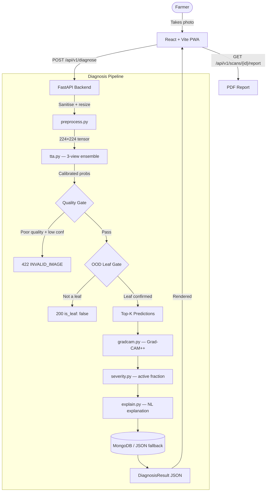

# Harvest Guard — Harvest Guard
### AI-Powered Crop Disease Diagnosis · On-Device Privacy · Field-Grade Accuracy

---

> [!IMPORTANT]
> **Backend API** is deployed and live on Render at the URL configured in `render.yaml`.
>
> **Cold Start Mitigation:** The FastAPI backend loads the MobileNetV2 model, runs a warmup inference, and seeds the disease knowledge base at startup — so the first `/api/v1/diagnose` call is never the slow one.

*A full-stack precision agriculture platform. Harvest Guard fuses a MobileNetV2 deep-learning classifier (38 crop-disease classes), temperature-calibrated Test-Time Augmentation (TTA), Grad-CAM++ saliency maps, and a natural-language explanation engine into a mobile-first Progressive Web App — helping farmers catch disease before it spreads.*

---

[](https://github.com/RishabhRana37/Harvest-Guard)
[](#-ml-pipeline)
[](https://fastapi.tiangolo.com/)
[](https://react.dev/)

[](https://www.python.org/)
[](https://tensorflow.org/)
[](https://www.mongodb.com/atlas)
[](https://www.typescriptlang.org/)
[](https://vite.dev/)

**[The Problem](#-the-problem) · [Core Features](#-core-features) · [Architecture](#-architecture-and-data-flow) · [ML Pipeline](#-ml-pipeline) · [API Endpoints](#-api-endpoints) · [Repository Layout](#-repository-layout) · [Quick Start](#-quick-start) · [Roadmap](#-roadmap)**

---

## The Problem

Smallholder farmers lose up to **30% of yields** annually to crop diseases — yet most lack access to agronomists. Existing solutions either require expensive connectivity, sacrifice accuracy, or provide no explanation for their predictions.

**Harvest Guard** solves this by combining:
* **On-device preprocessing** so the photo never leaves the phone until it's ready.
* **Dual-layer confidence scoring** — temperature-calibrated softmax + TTA ensemble — so uncertain predictions are clearly flagged.
* **Grad-CAM++ explainability** — highlighting exactly which part of the leaf triggered the diagnosis.
* **Natural-language treatment plans** — generated from a curated disease knowledge base, not hallucinated.

---

## Core Features

| Feature | Description | Implementation |
| :--- | :--- | :--- |
| **38-Class Leaf Diagnosis** | Identifies diseases across 14 crop species from a single photo | MobileNetV2 fine-tuned on PlantVillage, served via FastAPI |
| **Image Quality Gate** | Rejects blurry, dark, or non-leaf images before inference | Laplacian blur variance + HSV green-fill heuristics |
| **TTA Ensemble** | Averages predictions across 3 augmented views for robustness | Horizontal flip + vertical flip + original |
| **Grad-CAM++ Heatmaps** | Colour-coded saliency overlay showing disease focus area | Second-order gradient accumulation over last conv layer |
| **Severity Grading** | Classifies disease severity as mild/severe from heatmap coverage | Active pixel fraction threshold at 30% |
| **Natural Language Explanations** | Human-readable diagnosis with urgency timeline | Template engine in `services/explain.py` |
| **PDF Diagnostic Reports** | Downloadable A4 PDF with heatmap, disease detail, and treatments | ReportLab with embedded base64 imagery |
| **Offline-First PWA** | Scan history and disease library cached for offline access | IndexedDB via idb + Service Worker |
| **MongoDB + Local Fallback** | Cloud persistence with automatic JSON file fallback for dev | Motor async client + `FallbackDatabase` in `db.py` |

---

## Architecture and Data Flow



---

## ML Pipeline

### 1. MobileNetV2 Backbone (38 classes)
Fine-tuned on the PlantVillage dataset across 14 crop species:
Apple, Blueberry, Cherry, Corn, Grape, Orange, Peach, Bell Pepper, Potato, Raspberry, Soybean, Squash, Strawberry, Tomato.

### 2. Temperature Calibration
Post-hoc calibration divides logits by a learned scalar `T` before softmax, fixing overconfident predictions without retraining.

### 3. Test-Time Augmentation (TTA)
Three views (original, H-flip, V-flip) are averaged to reduce single-image variance, especially useful for edge-case orientations.

### 4. Grad-CAM++ Explainability
Second-order gradients are accumulated over the last convolutional feature map to produce a class-discriminative saliency map, overlaid on the original image as a colour heatmap.

### 5. Confidence Bands
| Band | Threshold | Meaning |
|:---|:---|:---|
| `high` | ≥ 80% | Strong prediction — act now |
| `medium` | 60–79% | Likely correct — monitor closely |
| `low` | < 60% | Uncertain — consider re-scanning |

---

## Repository Layout

```
Harvest-Guard/
├── backend/               # FastAPI Backend & ML Pipeline
│   ├── app/
│   │   ├── routers/       # Route handlers (diagnose, diseases, scans, report…)
│   │   ├── services/      # ML pipeline (inference, quality, TTA, gradcam, explain…)
│   │   ├── ml/model/      # Model artefacts (model.keras, class_index, calibration)
│   │   ├── data/          # Local JSON fallback database files
│   │   ├── utils/         # Error handling & rate limiting
│   │   ├── config.py      # Pydantic settings
│   │   ├── db.py          # MongoDB + local fallback
│   │   ├── main.py        # FastAPI app entry point
│   │   └── schemas.py     # Request/response Pydantic models
│   ├── tests/             # 30 integration & smoke tests
│   ├── Dockerfile         # Production Docker image
│   ├── requirements.txt
│   ├── pytest.ini
│   └── README.md          # Backend-specific documentation
│
├── frontend/              # React + Vite + TypeScript PWA
│   ├── src/
│   │   ├── components/    # Reusable UI (ScanButton, HeatmapViewer, ConfidenceGauge…)
│   │   ├── pages/         # App views (ScanPage, ResultPage, LibraryPage, HistoryPage…)
│   │   ├── services/      # API client & offline fixture data
│   │   ├── utils/         # IndexedDB helpers & image pipeline
│   │   ├── App.tsx        # Routing & context
│   │   └── index.css      # Design system & Tailwind config
│   ├── public/
│   └── package.json
│
├── scripts/               # Utility scripts
│   └── seed_db.py         # Seed diseases into MongoDB from JSON
│
├── .env.example           # Environment variable template
├── render.yaml            # Render Web Service deployment blueprint
├── vercel.json            # Vercel routing (frontend + backend)
└── README.md              # This file
```

---

## API Endpoints

| Method | Endpoint | Description |
| :--- | :--- | :--- |
| `POST` | `/api/v1/diagnose` | Upload a leaf image → diagnosis JSON |
| `GET` | `/api/v1/diseases` | List/search the 38-class disease knowledge base |
| `GET` | `/api/v1/diseases/{slug}` | Full disease detail with treatments |
| `GET` | `/api/v1/scans` | Scan history for a device (`X-Device-Id` header) |
| `GET` | `/api/v1/scans/{scan_id}` | Single scan result |
| `GET` | `/api/v1/scans/{scan_id}/report` | Download PDF diagnostic report |
| `POST` | `/api/v1/feedback` | Submit correction feedback |
| `GET` | `/api/v1/health` | Readiness probe (model load + DB status) |
| `GET` | `/api/v1/metrics` | Request counts, error rate, P50/P95 latency |
| `GET` | `/api/v1/model/info` | Model metadata, calibration params, validation metrics |

---

## Quick Start

### Prerequisites
* **Node.js** v18+
* **Python** 3.11+
* **MongoDB Atlas** URI (optional — local JSON fallback used automatically)

### 1. Clone the repository
```bash
git clone https://github.com/RishabhRana37/Harvest-Guard.git
cd Harvest-Guard
```

### 2. Run the Backend
```bash
cd backend
python -m venv venv
source venv/bin/activate      # Windows: venv\Scripts\activate
pip install -r requirements.txt

# Optional — copy and edit environment variables
cp ../.env.example .env

uvicorn app.main:app --reload --port 8000
```
Swagger UI: **http://localhost:8000/docs**

### 3. Run the Frontend
```bash
cd frontend
npm install
npm run dev
```
App: **http://localhost:5173**

### 4. Run Tests
```bash
cd backend
PYTHONPATH=. pytest
```

### 5. Seed the Database (optional)
```bash
cd backend
python ../scripts/seed_db.py
```

---

## Roadmap

- [x] **Phase 1 — Core Diagnosis Engine**
  - MobileNetV2 fine-tuning on PlantVillage (38 classes).
  - Temperature calibration + confidence band mapping.
  - FastAPI REST API with MongoDB + JSON fallback.
- [x] **Phase 2 — Explainability & Quality**
  - Grad-CAM++ saliency overlays.
  - Image quality gate (blur, brightness, leaf-fill).
  - Test-Time Augmentation (TTA) ensemble.
  - Severity grading from CAM active-pixel fraction.
  - Natural-language explanation generation.
  - PDF diagnostic report download.
- [ ] **Phase 3 — On-Device & Real-Time**
  - Convert model to TensorFlow Lite for on-device inference.
  - Implement WebSocket streaming for live camera diagnosis.
  - Add push notifications for scan follow-up reminders.
  - Integrate multi-language support (Hindi, Marathi, Tamil).

---

## License
This project is licensed under the MIT License.

---
**Harvest Guard — Bringing precision agriculture intelligence to every farmer's pocket.**
